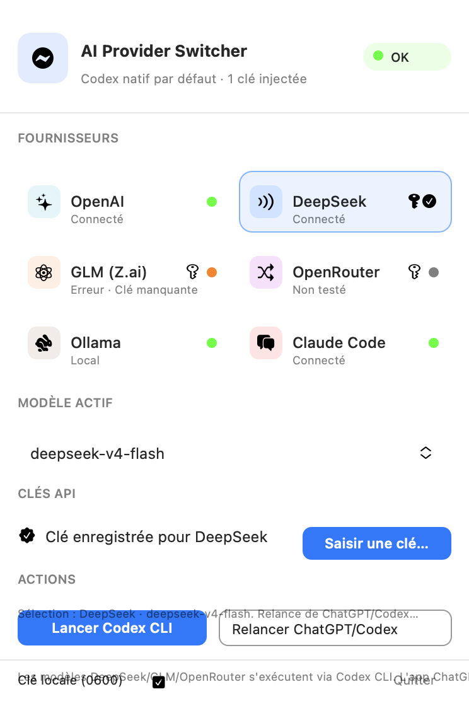

# AI Provider Switcher

Barre de menus macOS pour piloter les providers compatibles avec **Codex** depuis un panneau unique : DeepSeek, GLM (Z.ai), OpenRouter, Ollama, Claude Code et OpenCode Zen, tout en conservant le provider OpenAI natif.



> Capture du panneau en mode démonstration. Les statuts et présences de clés sont fictifs ; aucun secret n’est affiché.


## Ce que fait l’application

- Affiche l’état de connexion et la présence d’une clé pour chaque provider.
- Change le provider et le modèle actifs depuis la barre.
- Met à jour `model` et `model_provider` dans `~/.codex/config.toml` avec un override réversible.
- Relance Codex Desktop/ChatGPT lorsque cela est nécessaire pour recharger la configuration.
- Lance Codex CLI dans Terminal avec `--profile` et une clé injectée uniquement dans l’environnement.
- Génère un catalogue de modèles compatible avec le schéma Codex, limité au provider actif.
- Démarre des proxies locaux pour adapter les providers qui n’exposent pas directement l’API Responses.
- Donne le même jeu de fonctionnalités à tous les providers : MCP, shell, `apply_patch`, plugins et skills.
- Préserve les sections utilisateur, notamment MCP, et crée des sauvegardes avant les modifications.

## Providers disponibles

| Provider | Transport utilisé par Codex | Authentification | Adapter local | Vu par Codex comme | MCP · shell · apply_patch | Images | Web search |
|---|---|---|---:|:---:|:---:|:---:|:---:|
| OpenAI | Natif Codex | Session Codex | Non | lui-même | natif | oui | native |
| DeepSeek | Responses via proxy | `DEEPSEEK_API_KEY` | `127.0.0.1:18888` | slug natif | ponté | non | non |
| GLM (Z.ai) | Responses via proxy | `ZAI_API_KEY` | `127.0.0.1:18889` | slug natif | ponté | non | non |
| OpenRouter | Responses via proxy | `OPENROUTER_API_KEY` | `127.0.0.1:18890` | slug natif | ponté | oui | non |
| Claude Code | Responses ↔ Anthropic Messages | Session Claude Code / Trousseau | `127.0.0.1:18891` | slug natif | ponté | oui | serveur Anthropic |
| OpenCode Zen | Responses via proxy | Aucune saisie (clé publique ou clé d'OpenCode) | `127.0.0.1:18892` | slug natif | ponté | non | non |
| Ollama | Provider local Codex | Aucune | Non | son vrai slug | function tools | non | non |

« Slug natif » : le provider est exposé sous un slug de Codex, voir [Les providers passent pour des modèles de Codex](#les-providers-passent-pour-des-modèles-de-codex). « Ponté » : l’adaptateur traduit les familles de tools propres à OpenAI et restitue les items d’origine, voir [Parité des fonctionnalités](#parité-des-fonctionnalités-mcp-shell-apply_patch-plugins).

Les providers tiers sont déclarés dans `[model_providers.<id>]` avec :

```toml
[model_providers.deepseek]
name = "DeepSeek"
base_url = "http://127.0.0.1:18888/v1"
env_key = "DEEPSEEK_API_KEY"
requires_openai_auth = false
wire_api = "responses"
```

`requires_openai_auth = false` est important : Codex ne doit pas essayer d’appliquer le flux d’authentification OpenAI à un endpoint tiers. Les clés ne sont jamais écrites dans `config.toml`.

## Comment un changement de provider fonctionne

1. L’application vérifie la clé ou le mode sans clé.
2. Elle rafraîchit le bloc du provider et son profil `~/.codex/<id>.config.toml`.
3. Elle génère `~/.codex/catalog.json` pour le provider actif uniquement, sous les slugs de Codex.
4. Elle applique un override réversible de `model` (le slug) et `model_provider`. Le modèle réel est conservé dans `provider-switcher-state.json`.
5. Elle teste le endpoint `/v1/responses` via le proxy lorsque nécessaire.
6. Elle relance Codex Desktop/ChatGPT avec les variables d’environnement disponibles.

La carte OpenAI supprime l’override et revient à la configuration native. Les paramètres utilisateur et les serveurs MCP ne sont pas supprimés lors d’un changement de provider.

## Les providers passent pour des modèles de Codex

Codex conditionne une partie de ses fonctionnalités au **modèle** qu’il croit interroger : un slug inconnu peut perdre les outils, MCP, les plugins, les apps ou les skills, quoi que déclare le catalogue. Chaque provider routé par un adapter est donc exposé sous les **slugs de Codex lui-même**, avec la métadonnée que Codex a réellement téléchargée pour ces slugs (`~/.codex/models_cache.json`), instructions système comprises.

```text
Codex                      config.toml               adapter local            provider
gpt-5.6-sol  ──────────►  model = "gpt-5.6-sol"  ──►  swap du modèle  ──►  claude-haiku-4-5
             ◄──────────  model_provider = …     ◄──  slug restauré   ◄──
```

- Le panneau continue d’afficher les vrais modèles (`claude-haiku-4-5`) ; il indique en légende le slug vu par Codex.
- Le modèle par défaut du provider prend le slug principal (`gpt-5.6-sol`), puis chaque modèle reçoit le suivant : le sélecteur affiche autant d’entrées que le provider a de modèles.
- Les slugs internes de Codex (`gpt-reserve`, `codex-auto-review`) sont mappés sur le modèle par défaut, pour que les requêtes internes (revue automatique, délégation) aboutissent aussi.
- Le nom affiché reste explicite : `GPT-5.6-Sol · Claude Code`, description `Claude Code · claude-haiku-4-5`. Le slug seul est masqué, pas l’information.
- `~/.codex/<provider>.config.toml` utilise le même slug, donc Codex CLI (`--profile`) bénéficie du même contrat.
- Deux commutateurs natifs ne sont pas hérités : `use_responses_lite` (format de requête interne à OpenAI, non traduit par les adaptateurs) et `tool_mode = "code_mode_only"` (qui remplacerait le jeu d’outils classique — shell, apply_patch, MCP — par un unique outil de code).

Ollama et LM Studio sont des providers intégrés à Codex, sans adapter local : aucun composant ne peut réécrire le nom du modèle, ils gardent donc leurs vrais slugs.

À noter : les requêtes envoyées au provider tiers portent un nom de modèle OpenAI, et le journal local de Codex affichera `gpt-5.6-sol` là où DeepSeek ou Claude a répondu. C’est le prix du contrat natif ; la légende du panneau et la description du catalogue gardent la correspondance visible.

## Parité des fonctionnalités (MCP, shell, apply_patch, plugins)

Codex envoie plusieurs **familles d’outils** dans une même requête :

| Famille | Exemples | Qui l’exécute |
|---|---|---|
| function tools | `shell`, `update_plan`, `view_image`, **tous les tools MCP** | Codex |
| custom tools freeform | `apply_patch`, `exec`, code mode | Codex |
| `local_shell` | commande shell native | Codex |
| tools hébergés | `web_search` | le provider |

Seul OpenAI implémente les familles non-`function` sur le fil. Le proxy ne les jette plus : il les **traduit en function tools** à l’aller et **reconstruit l’item d’origine** au retour (`custom_tool_call`, `local_shell_call`, nom MCP original). Codex exécute donc lui-même shell, édition de fichiers, `apply_patch`, plugins, skills et serveurs MCP avec n’importe quel provider.

| Étage | Aller (Codex → provider) | Retour (provider → Codex) |
|---|---|---|
| `apply_patch` freeform | function tool `apply_patch({input})` | `custom_tool_call` avec le patch brut |
| `local_shell` | function tool `local_shell({command,…})` | `local_shell_call` avec son `action` |
| tool MCP `mcp.node_repl/run` | nom assaini `mcp_node_repl_run` | nom d’origine restauré |
| historique `custom_tool_call(_output)` | `function_call(_output)` | inchangé |
| `web_search` | Anthropic : outil serveur natif · autres : retiré | `web_search_call` |

Comme le provider passe pour un modèle de Codex, le catalogue conserve les capacités natives (`apply_patch_tool_type = "freeform"`, `shell_type = "shell_command"`, instructions plugins/apps/skills, `multi_agent_version`) : c’est le pont qui les rend exécutables. Pour Ollama, sans adapter, la saveur portable est utilisée à la place (`apply_patch_tool_type = "function"`, niveaux de raisonnement limités à `low`/`medium`/`high`).

Le proxy nettoie aussi la requête : les champs liés au compte OpenAI (`service_tier`, `prompt_cache_key`, `safety_identifier`) sont retirés et `reasoning.effort` est ramené à une valeur portable.

Reste une limite côté client, indépendante de l’application :

| Situation | Tools envoyés par Codex | Résultat |
|---|---:|---|
| Codex CLI | Oui | Toutes les familles sont pontées ; Codex exécute tools et MCP |
| Client qui envoie des tools au proxy | Oui | Les appels sont pontés puis restitués au client |
| Codex Desktop, sessions observées avec `tools=0` | Non | Le proxy demande une réponse texte plutôt qu’un faux appel d’outil |
| Provider qui émet un tool call sans tools reçus | Non | Résultat synthétique « outil indisponible » puis réponse texte |

Le flag natif suivant est également ajouté de façon marquée et réversible :

```toml
[tools]
web_search = true
```

Si l’utilisateur possède déjà une valeur `web_search`, elle est conservée (une seconde affectation dans la même table rendrait `config.toml` invalide). Les blocs MCP existants sont conservés tels quels : MCP est configuré dans `[mcp_servers.*]` et exécuté par Codex, donc il fonctionne avec le provider actif quel qu’il soit.

## Proxy local

`Resources/provider-proxy.py` expose un endpoint local compatible avec Codex :

- transforme `GET /v1/models` vers le catalogue attendu par Codex ;
- relaie les requêtes Responses vers les providers OpenAI-compatible ;
- traduit Responses ↔ Anthropic Messages pour Claude Code ;
- ponte toutes les familles de tools Codex vers des function tools, puis restitue les items d’origine ;
- réécrit l’historique des appels d’outils, sans quoi la conversation casse dès le premier tour ponté ;
- assainit les noms de tools (les tools MCP peuvent contenir `.` ou `/`, refusés par plusieurs endpoints) ;
- retire les champs propres au compte OpenAI et borne `reasoning.effort` ;
- transmet les function calls lorsque le client a réellement envoyé des tools ;
- bufferise les sessions Desktop `tools=0` et les réponses à restituer, afin de terminer proprement ;
- conserve un log technique par requête : provider, modèle, nombre de tools, streaming et pontages.

MCP est configuré et exécuté par Codex : le proxy voit les tools MCP comme des function tools ordinaires et les transmet. Il faut donc toujours vérifier que le provider gère correctement les schémas d’arguments de vos serveurs MCP.

## Claude Code

Claude Code n’utilise pas une clé saisie dans le panneau. Le proxy cherche, dans cet ordre :

1. le jeton OAuth Claude Code dans le Trousseau macOS (`Claude Code-credentials`) ;
2. `ANTHROPIC_AUTH_TOKEN` et `ANTHROPIC_BASE_URL` dans `~/.claude/settings.json` ;
3. une clé éventuellement fournie par la requête.

Le proxy convertit les messages et les tools entre le format Responses de Codex et le format Messages d’Anthropic. Trois points spécifiques à cet adaptateur :

- les images (`input_image`, captures, résultats de `view_image`) sont transmises comme vrais blocs image, data URL comprises, au lieu d’un marqueur texte ;
- `web_search` est mappé sur la recherche web côté serveur d’Anthropic, et la réponse est restituée en `web_search_call` ; si le compte ou le modèle la refuse (400), le tour est rejoué sans cet outil au lieu d’échouer ;
- `max_tokens` vaut 16384 par défaut, une valeur acceptée par les modèles Claude actuels et suffisante pour un patch complet.

## OpenCode

La CLI OpenCode est un agent, pas un backend HTTP : elle n'expose que son propre protocole de sessions (`opencode serve` → `POST /session/{id}/prompt`), inutilisable comme model provider. Ce qui est intégré ici est donc **OpenCode Zen**, la passerelle que la CLI interroge elle-même : `https://opencode.ai/zen/v1`, compatible OpenAI **et** servant `/v1/responses`, ce qu'attend Codex.

L'authentification suit celle d'OpenCode, aucune clé à saisir dans le panneau. Le proxy cherche, dans cet ordre :

1. une clé transmise par la requête (clé Zen payante relayée par Codex) ;
2. l'entrée `opencode` de `~/.local/share/opencode/auth.json`, écrite par `opencode auth login` ;
3. la clé publique documentée du palier gratuit.

La CLI est **détectée, pas requise** : la passerelle répond sans elle. Le panneau affiche l'état sous la grille des fournisseurs — version trouvée et origine de la clé, ou l'absence de la CLI. Les emplacements inspectés sont ceux de l'installeur OpenCode (`~/.opencode/bin`, Homebrew, `/usr/local/bin`, `~/.local/bin`). Seuls les **noms** des credentials sont lus, jamais les valeurs.

Les modèles déclarés sont ceux du palier gratuit, tels que listés par `opencode models opencode` :

```bash
opencode models opencode
```

## Clés et sécurité

- Les clés sont gardées en mémoire pendant la session.
- La persistance locale est activée par défaut dans `~/Library/Application Support/AI Provider Switcher/providers.json`.
- Le fichier est limité à `0600`, son dossier à `0700`, et exclu des sauvegardes iCloud/Time Machine.
- Les clés ne sont pas écrites dans `config.toml`, les profils, le catalogue ou les arguments de processus.
- Au lancement de ChatGPT/Codex, les clés sont injectées dans l’environnement du processus.
- Chaque modification de `config.toml` crée une sauvegarde dans `~/.codex/backup-provider-switcher/`.

## Installation

```bash
./scripts/build-app.sh --install --open
```

L’icône est générée par code, donc modifiable sans éditer de binaire :

```bash
swift scripts/make-app-icon.swift
```

Le script écrit `Resources/AppIcon.icns` (les dix représentations, chacune dessinée à sa taille native) que `build-app.sh` embarque dans le bundle. Le mark reprend le glyphe de la barre de menus (`bolt.horizontal.circle.fill`) sur une tuile turquoise → bleu, les deux couleurs d’accent du panneau.

`--install` copie le bundle dans `/Applications` (l’instance en cours est quittée avant remplacement) ; sans ce drapeau, l’app reste dans `build/`. L’application est construite en release, signée ad hoc avec Hardened Runtime et non sandboxée afin de pouvoir lancer Codex et Terminal. L’adaptateur `provider-proxy.py` est embarqué dans `Contents/Resources`, donc l’app installée ne dépend plus du dépôt.

Pour générer une capture reproductible du panneau :

```bash
./scripts/build-app.sh --no-sign
open "build/AIProviderSwitcher.app" --args --panel-screenshot
```

> Important : lancez toujours `build/AIProviderSwitcher.app` avec `open`, et non
> `.build/release/AIProviderSwitcher` ou `Contents/MacOS/AIProviderSwitcher` directement.
> `MenuBarExtra` a besoin du bundle `.app` et de son `CFBundleIdentifier` pour être
> enregistré correctement par macOS. L’icône apparaît ensuite dans la barre des menus.

Le mode `--panel-screenshot` utilise des données fictives, désactive les actions mutantes et ne touche ni `~/.codex` ni les clés locales.

## Fichiers générés

```text
~/.codex/config.toml                         configuration additive et override actif
~/.codex/<provider>.config.toml              profil CLI sans secret
~/.codex/catalog.json                        catalogue du provider actif
~/.codex/provider-switcher-state.json       état réversible de l’override
~/.codex/backup-provider-switcher/           sauvegardes avant modification
~/Library/Application Support/AI Provider Switcher/providers.json
                                             clés locales optionnelles, mode 0600
```

Les blocs gérés sont encadrés par `provider-switcher`. La désinstallation retire uniquement les blocs, profils et catalogues gérés par l’application, puis restaure la configuration native et préserve les sections utilisateur.

## Diagnostic

Vérifier le provider actif (le `model` est le slug vu par Codex, pas le modèle réel) :

```bash
awk '/^(model|model_provider) =/{print}' ~/.codex/config.toml
```

Vérifier la correspondance slug → modèle réel :

```bash
python3 -m json.tool ~/.codex/provider-switcher-state.json
```

Vérifier le catalogue et ses capacités :

```bash
python3 -m json.tool ~/.codex/catalog.json | grep -E 'slug|tool|patch|search|parallel'
```

Vérifier les proxies :

```bash
curl -s http://127.0.0.1:18888/v1/models | python3 -m json.tool
curl -s http://127.0.0.1:18889/v1/models | python3 -m json.tool
curl -s http://127.0.0.1:18890/v1/models | python3 -m json.tool
curl -s http://127.0.0.1:18892/v1/models | python3 -m json.tool
```

Si le Desktop affiche le provider mais n’exécute pas les tools, inspecter le log du proxy :

```text
[proxy DeepSeek] POST /v1/responses model=... tools=0 stream=True
```

`tools=0` signifie que la limitation vient du client Codex Desktop ou de la session active, pas du modèle upstream. Avec `tools>0`, les function calls sont conservés par le proxy.

Le pontage des tools est journalisé quand il modifie une définition, ce qui permet de vérifier qu’`apply_patch` et les tools MCP arrivent bien au modèle :

```text
[proxy Claude Code] bridge: apply_patch->apply_patch:custom, mcp.node_repl/run->mcp_node_repl_run:function
```

Le masquage du modèle est journalisé de la même façon :

```text
[proxy Claude Code] modele: gpt-5.6-sol -> claude-haiku-4-5
```

## Architecture

```text
Sources/
├── AIProviderSwitcher/
│   ├── AIProviderSwitcherApp.swift       MenuBarExtra et icône
│   ├── AppState.swift                    bootstrap, sélection, clés, proxies, watcher
│   ├── PanelView.swift                   panneau et interactions
│   └── Brand.swift                       identité visuelle des providers
└── AIProviderSwitcherCore/
    ├── Providers.swift                   catalogue providers/modèles
    ├── ModelMasquerade.swift             slugs natifs Codex ↔ modèles réels
    ├── OpenCodeCLI.swift                 détection de la CLI OpenCode
    ├── CodexConfigGenerator.swift        TOML et catalogue avec capacités tools
    ├── CodexConfigStore.swift             installation, override et réversibilité
    ├── CompatibilityChecker.swift         test de `/v1/responses`
    ├── KeyStore.swift                     mémoire et persistance 0600
    └── ProviderRouter.swift               état actif provider/modèle

Resources/provider-proxy.py               relay Responses, adaptateur Anthropic, pont d'outils
docs/screenshots/                         captures utilisées dans ce README
```

## Tests et build

```bash
swift test
swift build -c release
PYTHONDONTWRITEBYTECODE=1 python3 -m py_compile Resources/provider-proxy.py
PYTHONDONTWRITEBYTECODE=1 python3 -m unittest Tests/ProxyBehaviorTests.py
./scripts/build-app.sh --no-sign
plutil -p build/AIProviderSwitcher.app/Contents/Info.plist | grep CFBundleIdentifier
open build/AIProviderSwitcher.app
```

Si l’icône n’apparaît pas, quittez une ancienne instance puis relancez le bundle :

```bash
pkill -x AIProviderSwitcher 2>/dev/null || true
open build/AIProviderSwitcher.app
```

Les messages `com.apple.linkd.autoShortcut` peuvent être générés par macOS et ne
sont généralement pas la cause du problème. Le message `missing main bundle identifier`
indique en revanche que le binaire a été lancé hors de son bundle `.app`.

## Limites connues

- Codex Desktop peut afficher un provider tiers sans lui envoyer de tools ; les métadonnées du catalogue ne suffisent pas à modifier ce comportement du client. Avec `tools=0`, aucun pontage n’est possible.
- Le pontage garantit le transport des outils, pas la qualité du modèle : un provider qui suit mal un schéma d’arguments produira des appels `apply_patch` ou MCP invalides.
- Lorsqu’une réponse doit être reconstruite (`apply_patch`, `local_shell`, nom MCP assaini), le streaming est bufferisé : la réponse arrive d’un bloc au lieu d’être affichée token par token.
- Les tools hébergés côté OpenAI autres que `web_search` (`file_search`, `image_generation`, `code_interpreter`) sont retirés : aucun provider tiers ne peut les exécuter.
- Un slug natif ne peut être attribué qu’une fois : un provider offrant plus de modèles que Codex n’a de slugs verrait les derniers inaccessibles depuis le sélecteur.
- Le journal et la télémétrie locale de Codex attribuent la requête au slug natif, pas au provider réel.
- Le palier gratuit d'OpenCode Zen est limité par modèle : une réponse `FreeUsageLimitError` vient du quota de la passerelle, pas de l'application. Une clé Zen dans `opencode auth login` la lève.
- Les noms des modèles gratuits d'OpenCode Zen sont des préversions et changent régulièrement ; ils sont déclarés en dur et se vérifient avec `opencode models opencode`.
- Ollama est un provider intégré à Codex, sans adapter local : il reçoit les function tools du catalogue, mais pas le nettoyage de requête du proxy (un `service_tier` global dans `config.toml` lui est transmis tel quel).
- Les providers OpenAI-compatible n’implémentent pas tous Responses, le streaming, les images ou les tools de façon identique.
- Les proxies tournent tant que l’application de la barre de menus est active.
- Les modèles, quotas et noms de modèles peuvent évoluer côté provider.

## Références

- [Codex configuration](https://github.com/openai/codex/blob/main/docs/config.md)
- [Codex model catalog](https://github.com/openai/codex/blob/main/codex-rs/models-manager/models.json)
- [Codex model metadata implementation](https://github.com/openai/codex/blob/main/codex-rs/models-manager/src/model_info.rs)
- [Codex configuration reference discussion](https://github.com/openai/codex/issues/2760)
